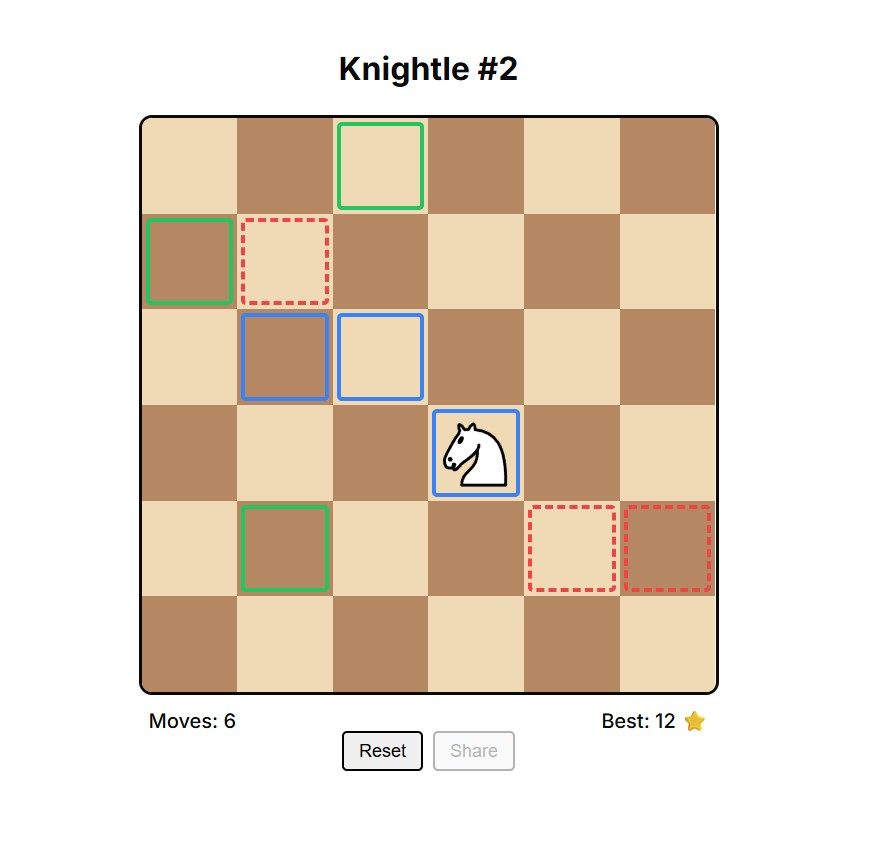

# Knightle

Knightle is a chess-inspired daily puzzle game. Find the shortest route while visiting all red squares.

Made for HackClub's [Toybox](https://toybox.hackclub.com/) YSWS.

## How To Play?

-   Click and drag the knight to move it to green squares. (Moblie is not supported)
-   Your objective is to land on all the red target squares in as few moves as possible.
-   Completed a puzzle? Share your score with friends! 🎉

## Potential Improvements

-   Mobile / touch support
-   Previous puzzles archive
-   More performant least moves algorithm

## Credits

-   [Knight SVG](https://commons.wikimedia.org/wiki/File:Chess_nlt45.svg)
-   [SFX](https://pixabay.com/users/floraphonic-38928062/)

## Like this project?

If you find this project interesting or useful, consider giving it a star ⭐️!
